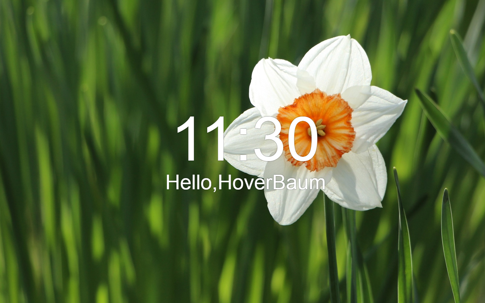

# Formosus

A plugin for Chrome that customizes the look of the "new Tab".

## Features

* Time of the day dependant greeting.
    * Multiple languages supported.
* Great background images powered by [unsplash.com](https://unsplash.com/).

### Supported languages

* Chinese (pinjin)
* Chinese (simplified)
* Dutch
* English
* French
* German

## Contribute

If you speak a language not supported yet you can contribute by submitting greetings for your language.

Found a bug? Open an issue :+1:

Want to help? Make a fork or let me know.
